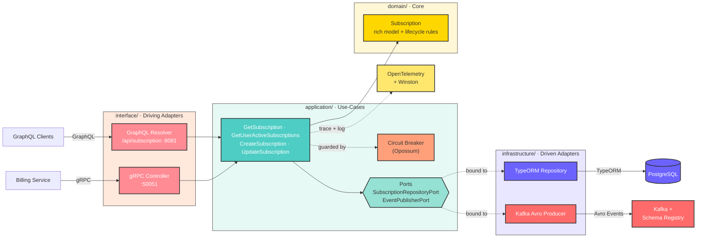

# Subscription Service


A NestJS microservice that manages SaaS subscription lifecycle. It exposes a **GraphQL API** for subscription CRUD operations, a **gRPC server** for internal service-to-service communication, and publishes domain events to **Apache Kafka** using Avro schemas.

## Architecture

The service follows a **hexagonal (ports & adapters)** architecture organised as
layered NestJS sub-modules under `src/subscription/`. The framework-free **domain**
sits at the centre; **application** use-cases depend only on **ports** (interfaces);
and **driving** adapters (GraphQL, gRPC) and **driven** adapters (TypeORM, Kafka)
plug in at the edges. The dependency direction always points inward — infrastructure
depends on the core, never the reverse.



## Tech Stack

| Concern | Technology |
|---|---|
| Runtime | Node.js / TypeScript |
| Framework | NestJS 11 |
| API | GraphQL (Apollo Server 5) |
| Internal RPC | gRPC (Buf Registry fetch) |
| Database | PostgreSQL (TypeORM) |
| Messaging | Apache Kafka (KafkaJS + Confluent Schema Registry) |
| Schema | Avro |
| Resilience | Opossum circuit breaker |
| Observability | OpenTelemetry (traces + logs), Winston |
| Testing | Jest + Testcontainers |
| Package manager | pnpm |

## Features

- **GraphQL API** — create, update, and query subscriptions via `/api/subscription`
- **gRPC server** on port `50051` — exposes subscription data to billing-service
- **Kafka producer** — publishes `subscription.created` and `subscription.updated` events with Avro-encoded payloads to Confluent Schema Registry
- **Circuit breaker** — read and create use-cases wrap their repository calls with Opossum; falls back gracefully on failure
- **OpenTelemetry** — distributed tracing exported via OTLP HTTP; spans created per service operation
- **Database migrations** — TypeORM migrations managed via CLI
- **Health endpoint** — `GET /healthz/live`

## Project Structure

The subscription bounded context is organised as a hexagon under `src/subscription/`,
with each layer wired as its own NestJS module (`ApplicationModule`,
`InfrastructureModule`, `InterfaceModule`) composed by `SubscriptionModule`.

```
subscription-service/
├── src/
│   ├── subscription/                  # Subscription bounded context (the hexagon)
│   │   ├── domain/                    # Framework-free core
│   │   │   ├── subscription.ts        #   rich model: create/applyUpdate/cancel/renew
│   │   │   ├── subscription-status.enum.ts
│   │   │   └── subscription.errors.ts #   domain errors
│   │   ├── application/               # Use-cases + ports (the inside)
│   │   │   ├── use-cases/             #   Get / GetUserActive / Create / Update
│   │   │   ├── ports/                 #   repository + event-publisher interfaces + tokens
│   │   │   ├── dtos/                  #   use-case input contracts
│   │   │   ├── subscription-event.publisher.ts
│   │   │   ├── subscription.mapper.ts #   domain → event payloads
│   │   │   ├── support/               #   circuit-breaker interface
│   │   │   └── application.module.ts
│   │   ├── infrastructure/            # Driven adapters (implement the ports)
│   │   │   ├── persistence/           #   TypeORM entity, repository, ORM↔domain mapper
│   │   │   ├── messaging/             #   Kafka Avro event producer
│   │   │   ├── resilience/            #   Opossum circuit breaker
│   │   │   └── infrastructure.module.ts
│   │   ├── interface/                 # Driving adapters
│   │   │   ├── graphql/               #   resolver + GraphQL type
│   │   │   ├── grpc/                  #   controller + proto mapper
│   │   │   └── interface.module.ts
│   │   └── subscription.module.ts     # Composition root
│   ├── controller/                    # App-level health endpoint
│   ├── logger/                        # Winston logger
│   ├── schemas/                       # Avro schemas (.avsc) + GraphQL schema
│   ├── pb/                            # Generated gRPC stubs
│   ├── lib/                           # Shared logger + tracing helpers
│   ├── logger.module.ts              # Logger module
│   ├── app.module.ts                 # Root module
│   ├── tracing.ts                    # OpenTelemetry bootstrap
│   └── main.ts                       # Application entry point
├── migrations/                        # TypeORM migration files
└── test/                              # Integration, wiring, pact + e2e tests
```

## Getting Started

### Prerequisites

- Node.js 22+
- pnpm
- PostgreSQL
- Kafka + Confluent Schema Registry
- (Optional) OpenTelemetry Collector

### Environment Variables

Create a `.env` file in `subscription-service/`:

```env
PORT=8081
POSTGRES_HOST=localhost
POSTGRES_PORT=5433
POSTGRES_USER=subscription_user
POSTGRES_PASSWORD=subscription_password
POSTGRES_DB=subscription_db
DB_POOL_MAX=20
DB_POOL_MIN=5
KAFKA_BROKERS=localhost:9092
SCHEMA_REGISTRY_URL=http://localhost:9094
OTEL_EXPORTER_OTLP_ENDPOINT=http://localhost:4318
```

### Install & Run

```bash
# Install dependencies
pnpm install

# Run database migrations
pnpm run-migrations

# Start in development mode
pnpm start:dev

# Start in production mode
pnpm start:prod
```

### Build

```bash
pnpm build
```

### Testing

```bash
# Unit + integration tests (requires Docker for Testcontainers)
pnpm test

# With coverage
pnpm test:cov

# E2E tests
pnpm test:e2e
```

## API

### GraphQL

Playground available at `http://localhost:8081/api/subscription` (dev mode).

**Example — create a subscription:**

```graphql
mutation {
  createSubscription(input: {
    userId: "3f0e4f7a-1c2b-4d5e-8a90-1234567890ab"
    planId: "plan-pro"
  }) {
    id
    status
    planId
    currentPeriodStart
    currentPeriodEnd
  }
}
```

> `status` defaults to `ACTIVE` and the 30-day billing period
> (`currentPeriodStart` / `currentPeriodEnd`) is computed by the domain model.

### gRPC

The service implements the `SubscriptionService` defined in `src/proto/subscription.proto`. Billing-service connects to `host:50051` to fetch subscription details.

## Kafka Events

| Topic | Event | Trigger |
|---|---|---|
| `subscription.created` | `SubscriptionCreatedEvent` | New subscription created |
| `subscription.updated` | `SubscriptionUpdatedEvent` | Subscription plan/status changed |

Payloads are Avro-encoded. Schemas are registered in Confluent Schema Registry and stored in `src/schemas/`.

## Docker

```bash
docker build -t subscription-service .
docker run -p 8081:8081 -p 50051:50051 --env-file .env subscription-service
```

## CI/CD

GitHub Actions workflows are in `.github/workflows/`:

- `subscription-service-ci.yml` — lint, test, build on push/PR
- `subscription-service-cd.yml` — build & push Docker image on merge to main
- `test.yml` — standalone test runner

## License

MIT
## Security & Guardrails

Container supply-chain guardrails run in CI and locally — see [`policy/README.md`](policy/README.md).

- **Dockerfile Policy as Code** — OPA/Rego via `conftest` (`policy/docker/`): hard-gates unpinned/`:latest` base images, `USER root` final stages, and `ADD <remote-url>`; warns on missing `USER`/`HEALTHCHECK`, tag-not-digest, `apt` without `--no-install-recommends`, etc.
- **Checkov** — Dockerfile + secret scanning (baseline/report mode).
- **Trivy** — image scanning **before push** in the build pipeline (fail-closed on fixable CRITICAL/HIGH), plus `trivy fs` (deps) and `trivy config` (misconfig) on PRs. Complements source-level scanning (e.g. SonarQube).

```bash
./scripts/guardrails.sh   # conftest + checkov + trivy (skips tools not installed)
```

CI: [`.github/workflows/security.yml`](.github/workflows/security.yml) (PR gate) + the Trivy image scan wired into the build workflow.
