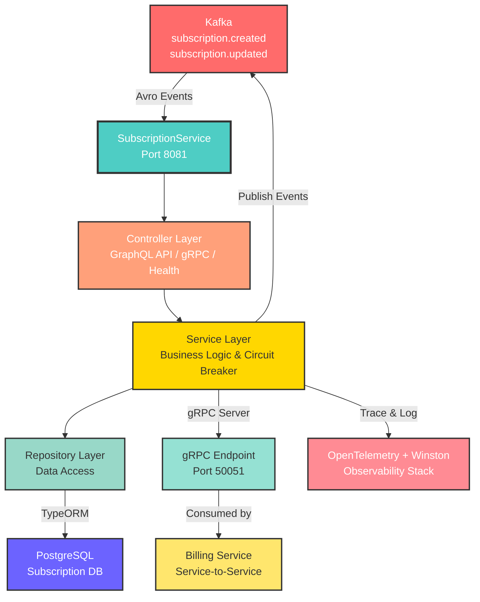

# Subscription Service


A NestJS microservice that manages SaaS subscription lifecycle. It exposes a **GraphQL API** for subscription CRUD operations, a **gRPC server** for internal service-to-service communication, and publishes domain events to **Apache Kafka** using Avro schemas.

## Architecture



## Tech Stack

| Concern | Technology |
|---|---|
| Runtime | Node.js / TypeScript |
| Framework | NestJS 11 |
| API | GraphQL (Apollo Server 5) |
| Internal RPC | gRPC (Buf Registry fetch) |
| Database | PostgreSQL (TypeORM) |
| Messaging | Apache Kafka (KafkaJS + Confluent Schema Registry) |
| Schema | Avro |
| Resilience | Opossum circuit breaker |
| Observability | OpenTelemetry (traces + logs), Winston |
| Testing | Jest + Testcontainers |
| Package manager | pnpm |

## Features

- **GraphQL API** — create, update, and query subscriptions via `/api/subscription`
- **gRPC server** on port `50051` — exposes subscription data to billing-service
- **Kafka producer** — publishes `subscription.created` and `subscription.updated` events with Avro-encoded payloads to Confluent Schema Registry
- **Circuit breaker** — wraps all repository calls with Opossum; falls back gracefully on failure
- **OpenTelemetry** — distributed tracing exported via OTLP HTTP; spans created per service operation
- **Database migrations** — TypeORM migrations managed via CLI
- **Health endpoint** — `GET /healthz/live`

## Project Structure

```
subscription-service/
├── src/
│   ├── controller/          # gRPC controller + health endpoint
│   ├── service/             # Business logic + circuit breaker wiring
│   ├── repository/          # TypeORM data access
│   ├── resolvers/           # GraphQL resolvers
│   ├── events/              # Kafka Avro event producer
│   ├── model/
│   │   ├── entities/        # TypeORM entities
│   │   ├── dtos/            # Input/output DTOs
│   │   └── domain/          # Domain types
│   ├── schemas/             # Avro schemas (.avsc) + GraphQL schema
│   ├── proto/               # Protobuf definition
│   ├── pb/                  # Generated gRPC stubs
│   ├── mapper/              # Entity ↔ DTO mapping
│   ├── lib/                 # Shared logger
│   ├── tracing.ts           # OpenTelemetry bootstrap
│   └── main.ts              # Application entry point
├── migrations/              # TypeORM migration files
└── test/                    # Integration + e2e tests
```

## Getting Started

### Prerequisites

- Node.js 22+
- pnpm
- PostgreSQL
- Kafka + Confluent Schema Registry
- (Optional) OpenTelemetry Collector

### Environment Variables

Create a `.env` file in `subscription-service/`:

```env
PORT=8081
POSTGRES_HOST=localhost
POSTGRES_PORT=5433
POSTGRES_USER=subscription_user
POSTGRES_PASSWORD=subscription_password
POSTGRES_DB=subscription_db
DB_POOL_MAX=20
DB_POOL_MIN=5
KAFKA_BROKERS=localhost:9092
SCHEMA_REGISTRY_URL=http://localhost:9094
OTEL_EXPORTER_OTLP_ENDPOINT=http://localhost:4318
```

### Install & Run

```bash
# Install dependencies
pnpm install

# Run database migrations
pnpm run-migrations

# Start in development mode
pnpm start:dev

# Start in production mode
pnpm start:prod
```

### Build

```bash
pnpm build
```

### Testing

```bash
# Unit + integration tests (requires Docker for Testcontainers)
pnpm test

# With coverage
pnpm test:cov

# E2E tests
pnpm test:e2e
```

## API

### GraphQL

Playground available at `http://localhost:8081/api/subscription` (dev mode).

**Example — create a subscription:**

```graphql
mutation {
  createSubscription(input: {
    userId: "user-123"
    planId: "plan-pro"
    currentPeriodStart: "2025-01-01T00:00:00Z"
    currentPeriodEnd: "2025-02-01T00:00:00Z"
  }) {
    id
    status
    planId
  }
}
```

### gRPC

The service implements the `SubscriptionService` defined in `src/proto/subscription.proto`. Billing-service connects to `host:50051` to fetch subscription details.

## Kafka Events

| Topic | Event | Trigger |
|---|---|---|
| `subscription.created` | `SubscriptionCreatedEvent` | New subscription created |
| `subscription.updated` | `SubscriptionUpdatedEvent` | Subscription plan/status changed |

Payloads are Avro-encoded. Schemas are registered in Confluent Schema Registry and stored in `src/schemas/`.

## Docker

```bash
docker build -t subscription-service .
docker run -p 8081:8081 -p 50051:50051 --env-file .env subscription-service
```

## CI/CD

GitHub Actions workflows are in `.github/workflows/`:

- `subscription-service-ci.yml` — lint, test, build on push/PR
- `subscription-service-cd.yml` — build & push Docker image on merge to main
- `test.yml` — standalone test runner

## License

MIT
